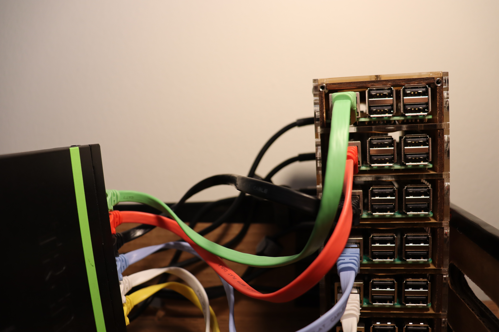

<h1>6 node Raspberry Pi cluster created using Kubernetes, and Docker</h1>

  
  

<em>Collaborated with Guerilla Tape and random cardboard box to build the container to house the cluster. Is it ugly? Maybe. But does it work? Kind of, it's a little wobbley.</em>

---

Created this cluster by following along with *Kubernetes Up and Running By Hightower, Burns , Beda*, *kubernetes.io/docs/home/*, *docs.docker.com*, and *https://blog.hypriot.com/post/setup-kubernetes-raspberry-pi-cluster/*

---

The `master` node doubles as the Kubernetes Master, and responsible for handing out IP addresses as a `isc-dhcp-server`. 
Then the rest of the 5 nodes, `node-(2-5)` are the workers. 

Currently in use just for creating, testing, and learning about containerized applications and orchestration.  

<h2>Notes</h2>

#Things to look at

Look through Helm Documentation: https://helm.sh/docs/

High Performance Computing: https://www.open-mpi.org/ , http://dispy.sourceforge.net/

<h3>Why build this?</h3>
To learn about what it can do!
Can I eventually automate my apartment, or create a cool service I can access from a different city?
That's what I'm going to figure out! And when I do, I'll post the results here. 

<h4> Help From: </h4>
https://github.com/geerlingguy/raspberry-pi-dramble  
https://github.com/rak8s/rak8s  
https://github.com/teamserverless/k8s-on-raspbian  
http://downey.io/blog/how-to-build-raspberry-pi-kubernetes-cluster/  

